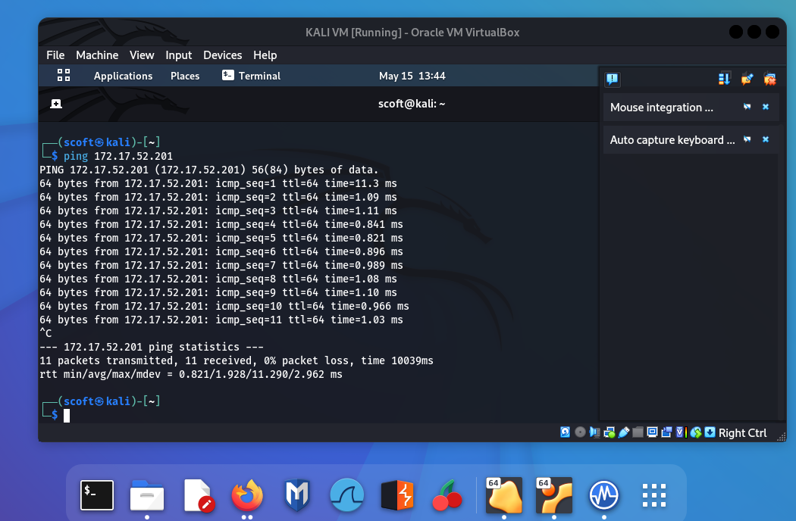
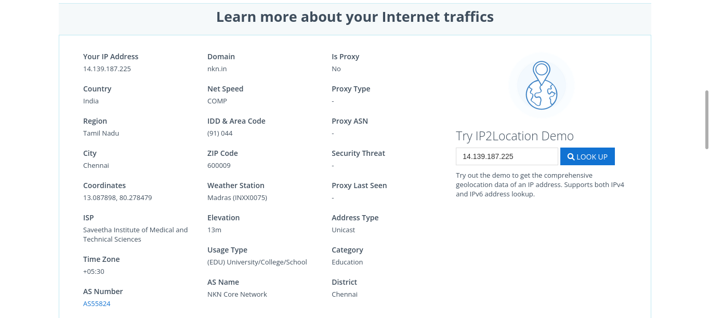

# InformationGathering

# AIM:

To perform information gathering techniques using kali linux 

## STEPS:

### Step 1:

Install kali linux either in partition or virtual box or in live mode

### Step 2:

Investigate on the various categories of tools as follows:

### Step 3:
Open terminal/browser and try execute necessary commands/use url to perform information gathering

<<<<<<< HEAD
### Pen Test Tools Categories:  

Following Categories of pen test tools are identified for information gathering:

Footprinting is a part of the reconnaissance process which is used for gathering possible information about a target computer system or network.
http://www.whois.com/whois website to get detailed information about a domain name information including its owner, its registrar, date of registration, expiry, name server, owner's contact information, etc.

### output

#### Finding IP address:
ping command is available on Windows as well as on Linux OS. Following is the example to find out the IP address of facebook.com.

#### ip2location.com :
Finding Hosting Company
get further detail by using ip2location.com website.

#### History of the website:
https://web.archive.org/

#### Webserver Fingerprinting:

#### Netcat:

 
#### nmap:

#### Whatweb:

#### httprint

### Tracing the Location
#### TCP Traceroute:

#### UDP Traceroute:

#### ICMP Traceroute:

### RESULT:
The information gathering techniques tools/procedure were  identified successfully
